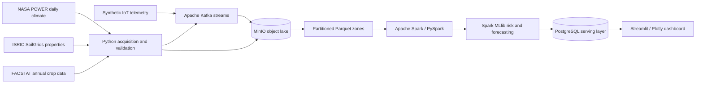

# YieldLens Nigeria Architecture

This is the target end-to-end architecture. Phase 1 provisions only the platform components and application foundation; arrows representing acquisition, processing, analytics, and delivery are contracts for later approved phases, not claims of completed integration.
